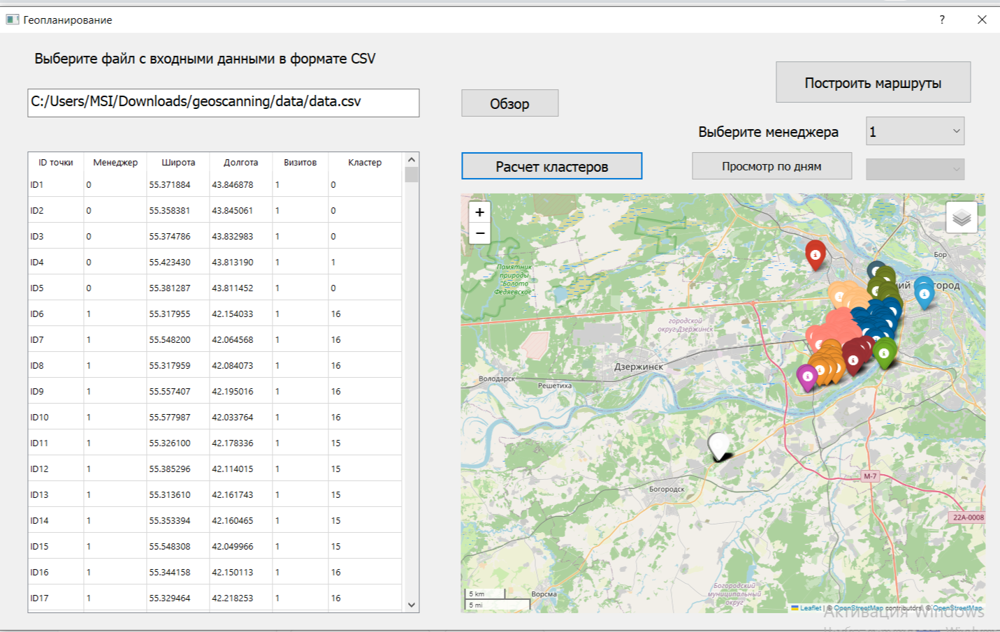
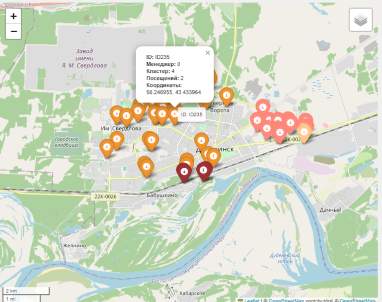
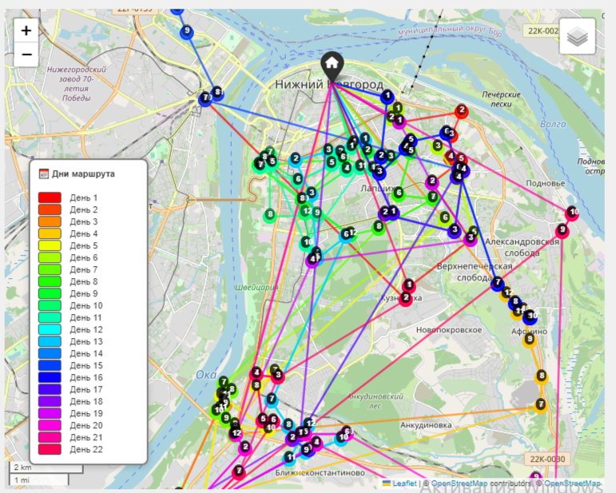
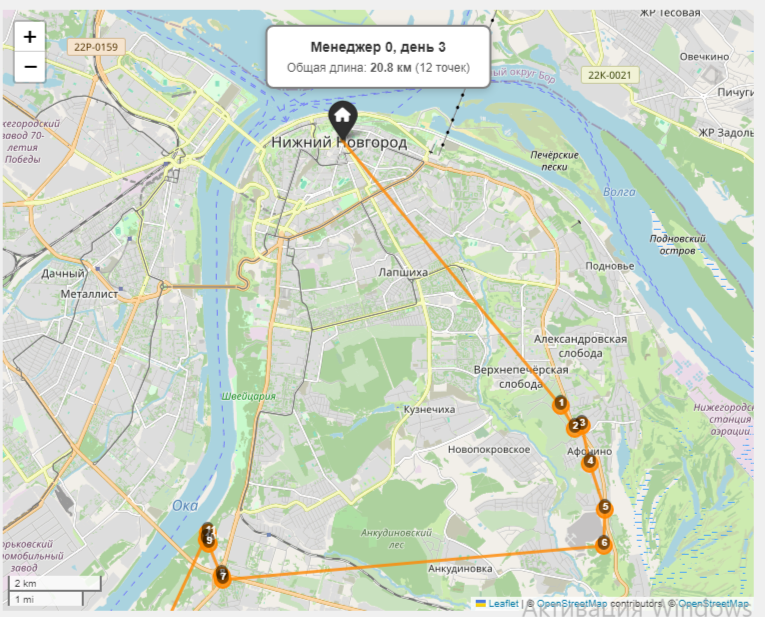
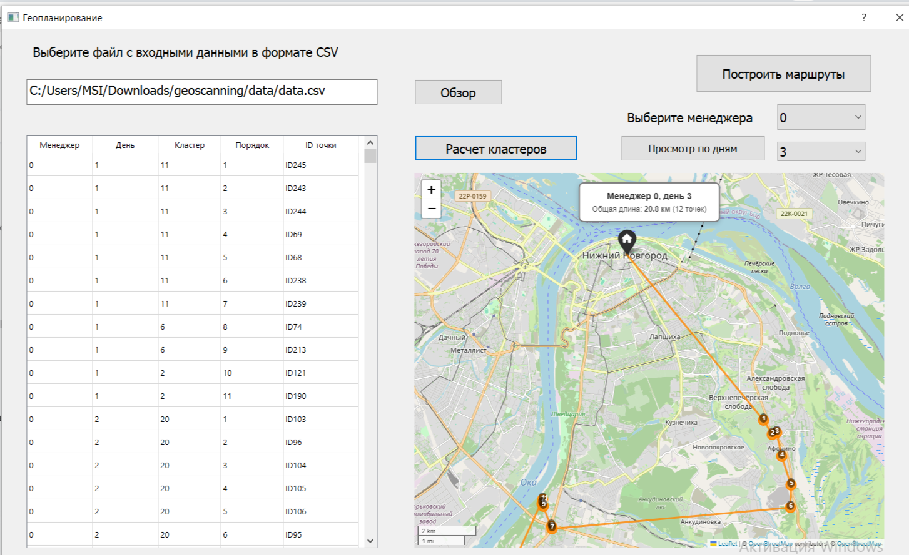

#  Geoscanning — кластеризация и построение маршрутов

Приложение для кластеризации географических данных и построения оптимальных маршрутов для менеджеров.

---
##  Оглавление

- [Описание](#-описание)
- [Возможности](#-возможности)
- [Структура проекта](#-структура-проекта)
- [Установка](#-установка)
- [Использование](#-использование)
- [Форматы данных](#-форматы-данных)
- [Конфигурация](#-конфигурация)
- [Выходные файлы](#-выходные-файлы)
- [Технологии](#-технологии)
- [Скриншоты](#-скриншоты)

---

###  Описание

Geoscanning — это десктопное приложение на PyQt5 для:
- Загрузки данных о точках с координатами
- Кластеризации точек по менеджерам с использованием иерархической кластеризации
- Построения маршрутов с учётом ограничений по дням и визитам
- Визуализации кластеров и маршрутов на интерактивных картах
- Просмотра маршрутов по дням

---

### Возможности

- **Загрузка данных** из CSV-файлов
- **Кластеризация** точек с использованием матрицы расстояний
- **Построение маршрутов** для каждого менеджера с балансировкой по дням
- **Визуализация** на картах с помощью folium
- **Просмотр по дням** — отображение маршрута для конкретного дня
- **Таблицы** с детальной информацией о точках и маршрутах
- **Сохранение** результатов в CSV-файлы
- **Воспроизводимость** результатов с фиксированным seed

---

###  Структура проекта

```
geoscanning/

├── notebooks
|    ├──  geoscan.ipynb     # тетрадь с исследованиями
|    ├──  docs              # карты из тетради для корректного отображения         
├── data/
|    ├── distance_matrix.csv # Матрица расстояний
|    ├── nn_dists_km.npy    # Расстояния от базы
├── leaflet/                # Локальные зависимости Leaflet для офлайн-карт
├── src/
|    ├── clustering.py      # Кластеризация точек
|    ├── routing.py         # Построение маршрутов
|    ├── visualize.py       # Генерация карт
|    ├── utils.py           # Утилиты для таблиц
|    ├── point.py           # Класс Point
├── ui/                     # Файлы интерфейса
|    ├── geoscan.ui         # Дизайн в Qt Designer
|    ├── ui_geoscan.py      # Сгенерированный код
├── output/                 # Выходные файлы (создаётся автоматически)
│    ├── maps/              # HTML-карты
│    ├── routes/            # CSV с маршрутами
│    └── stats/             # CSV со статистикой
├── screenshots/               # ← Новая папка
│   ├── main_window.png
│   ├── clusters_map.png
│   ├── day_route.png
│   └── data_table.png
├── main.py                 # Точка входа
├── README.md               # документация по проекту
├── requirements.txt        # Python-зависимости
├── config.py                # Конфигурация
└── .gitignore
```
---

###  Установка

#### 1. Клонирование репозитория

```bash
git clone [https://github.com/MaryaMalyshkina/geoscanning.git]
cd geoscanning
```

#### 2. Создание виртуального окружения
```bash
# Windows
python -m venv venv
venv\Scripts\activate

# Linux/Mac
python3 -m venv venv
source venv/bin/activate
```

#### 3. Установка зависимостей

```bash
pip install -r requirements.txt
```
---

### Использование

```bash
Запуск
python main.py
```
**Пошаговая инструкция**
1. **Загрузка данных**

Нажмите кнопку «Обзор» и выберите CSV-файл с точками

Нажмите «Расчет кластеров» — выполнится загрузка и кластеризация

2. **Построение маршрутов**

После завершения кластеризации нажмите «Построить маршруты»

Маршруты строятся для всех менеджеров одновременно

3. **Просмотр результатов**

**Карта** — отображает кластеры или маршруты для выбранного менеджера

**Таблица** — показывает детальную информацию о маршрутах (после построения)

**Комбобокс** — выбор менеджера для просмотра

4. **Просмотр по дням**

Нажмите «Просмотр по дням»

Выберите день в комбобоксе

На карте отобразится маршрут для выбранного менеджера и дня

---

### Форматы данных

**Формат входных данных**

CSV-файл должен содержать следующие колонки:

| Колонка|	Описание|Пример|
| :--------------------   | :---------------------                                      |:---------------------------|
| point_id	|Уникальный идентификатор точки	|P001|
|manager|	ID менеджера|	0|
|lat	|Широта|	56.3287|
|lon	|Долгота|	44.0020|
|n_visits	|Количество визитов в месяц (1или 2)|	2|

**Формат выходных CSV-файлов**

CSV-файл должен содержать следующие колонки:

| Колонка|	Описание|
| :--------------------   | :---------------------                                      |
| point_id	|Уникальный идентификатор точки	|
|visit_day|	Номер дня (1–22)|	
|cluster_id	|Номер кластера|
|order_in_route	|Порядковый номер в маршруте|

---

### Конфигурация (config.py)

```bash
# Ограничения
DAYS = 22
MAX_VISITS_PER_DAY = 12
MAX_DISTANCE_FROM_BASE_KM = 150

# База
NN_LAT = 56.326887
NN_LON = 44.005986

# Кластеризация
EPS_METERS = 4000  # порог расстояния в метрах для иерархической кластеризации

# Пути 
DISTANCE_MATRIX_PATH = 'data/distance_matrix_undirected.csv'
NN_DISTANCES_PATH = 'data/nn_dists_km.npy'

# Базовые пути
BASE_DIR = os.path.dirname(os.path.abspath(__file__))

# Выходные данные
OUTPUT_DIR = os.path.join(BASE_DIR, "output")
MAPS_DIR = os.path.join(OUTPUT_DIR, "maps")
ROUTES_DIR = os.path.join(OUTPUT_DIR, "routes")
STATS_DIR = os.path.join(OUTPUT_DIR, "stats")

# Воспроизводимость
RANDOM_SEED = 42
```

---


### Выходные файлы

Все результаты сохраняются в папку output/:

| Путь|	Содержание|
| :--------------------   | :---------------------                                      |
| output/maps/*.html	|Интерактивные карты с маршрутами	|
|output/routes/*_routes_{manager}.csv|	Маршруты по дням|	
|output/routes/*_clustered.csv	|Результаты кластеризации|
|output/stats/*_stats_{manager}.csv	|Статистика по дням|

---

### Технологии

|Компонент|	Технология|
| :--------------------   | :---------------------                                      |
|Язык	|Python 3.10+	|
|GUI|	PyQt5 |	
|Визуализация карт|Folium|
|Обработка данных|Pandas, NumPy|
|Кластеризация|SciPy (иерархическая)|
|Графы (дорожная сеть)|NetworkX, OSMnx|

---

### Скриншоты

#### Главное окно приложения


*Интерфейс приложения после загрузки данных и выполнения кластеризации.*

---

#### Кластеризация на карте


*Визуализация кластеров для выбранного менеджера. Точки одного кластера обозначены одинаковым цветом.*

---

#### Маршруты по всем дням


*Маршруты по всем дням для одного менеджера.*

---
#### Маршруты по одному дню


*Маршрут для конкретного дня: база (чёрный маркер) → точки в порядке обхода (синяя линия).*

---

#### Таблица с результатами


*Детальная информация о маршрутах: менеджер, день, кластер, номер точки в маршруте, ID точки.*
